# AI-Powered SHL Assessment Recommendation Engine


> A hybrid semantic retrieval system that maps recruiter queries to SHL assessments using FAISS and Sentence Transformers.

---

## 🧭 Problem Statement

The *SHL AI Developer Challenge* tasked candidates with designing and implementing a *Generative AI–powered Assessment Recommendation Engine*.  
The system must automatically analyze *free-text hiring or recruitment queries* and map them to the most *semantically relevant SHL product assessments* available in the SHL catalog.

### 🎯 Objective

To build an *intelligent retrieval system* that can:
- Understand recruiter intent and context expressed in natural language.
- Accurately retrieve relevant SHL assessment products based on semantic meaning.
- Operate efficiently at scale for real-time recommendation use cases.

In simple terms:  
> “Given any recruiter query, the system should return the most appropriate SHL assessment links.”

---

### 🧩 Example Use Case

*Input (Recruiter Query):*

`"I am hiring for software engineers with cognitive and behavioral assessment requirements"`


**Expected Output (Recommended URLs):**
```link
https://www.shl.com/products/assessments/cognitive-assessments/
```
```link
https://www.shl.com/products/assessments/personality-assessment/
```


The solution should work for any arbitrary query related to assessments, skill evaluation, leadership, or hiring needs.

---

## 🧠 Project Overview

The project is built as an *end-to-end AI-driven recommendation pipeline, leveraging both **semantic understanding* and *keyword-level precision* to generate results that are contextually and lexically aligned with the user query.

It integrates *FAISS (Facebook AI Similarity Search)* for high-speed vector retrieval and *TF-IDF (Term Frequency–Inverse Document Frequency)* for keyword-based scoring — combining both to form a *hybrid retrieval strategy*.

### 🔹 Core Design Philosophy

| Layer | Description |
|--------|-------------|
| *Semantic Layer* | Converts all catalog entries into embeddings using Sentence Transformers (all-MiniLM-L6-v2). This allows the system to understand meaning, not just words. |
| *Lexical Layer* | Uses TF-IDF vectorization to identify keyword matches and reinforce contextually strong matches. |
| *Hybrid Scoring Mechanism* | Merges results from both models using weighted averaging to maximize recall and precision. |
| *API Layer (FastAPI)* | Serves as an interface to query recommendations through a REST endpoint (/recommend). |
| *Automation Layer* | A script (generate_submission.py) automates testing and submission CSV generation. |

This design ensures *fast, accurate, and explainable recommendations* while remaining lightweight and fully reproducible.

---

### 🔹 Key Highlights

- *Context-Aware Retrieval:* Captures deep semantic relationships in recruiter queries.  
- *Keyword Sensitivity:* Uses TF-IDF to retain alignment with explicit job descriptions.  
- *Optimized Search:* FAISS enables sub-second vector lookup even for thousands of entries.  
- *Automated Evaluation:* Generates submission.csv automatically through the provided test dataset.  
- *Offline Capability:* Runs entirely locally without dependence on external APIs.

---

## ⚙ Core Features

| Feature | Description |
|----------|-------------|
| *Hybrid AI Retrieval* | Combines FAISS (semantic) and TF-IDF (lexical) for robust matching. |
| *FastAPI REST Interface* | Provides a production-grade API endpoint /recommend for live querying. |
| *Automated Submission Pipeline* | Generates the final submission.csv using SHL’s provided test dataset. |
| *Cross-Platform Compatibility* | Fully runnable on Windows, macOS, or Linux (tested on Windows + VS Code). |
| *Reproducibility & Transparency* | Every step, from data cleaning to model inference, is traceable. |
| *Scalable & Efficient* | Optimized for quick embedding lookups and minimal resource usage. |

---

## 🧩 Technologies Used

| Category | Tools & Libraries | Purpose |
|-----------|-------------------|----------|
| *Programming Language* | Python 3.10+ | Core project development |
| *Web Framework* | FastAPI, Uvicorn | API development and serving |
| *Semantic Search* | Sentence Transformers (all-MiniLM-L6-v2), FAISS | Converts text into embeddings & performs fast vector search |
| *Lexical Search* | Scikit-learn (TF-IDF) | Keyword-level matching for precision |
| *Data Handling* | Pandas, NumPy | Data cleaning and manipulation |
| *Automation & Utilities* | tqdm, Requests | Batch query processing and API integration |
| *File I/O* | openpyxl | Excel data reading and writing |
| *Version Control* | Git, GitHub | Source management and submission tracking |

---

### 🧮 Why These Technologies?

| Component | Reason for Selection |
|------------|----------------------|
| *FAISS* | Industry-standard for efficient similarity search on high-dimensional embeddings. |
| *Sentence Transformers* | Pre-trained on massive text datasets, providing powerful semantic understanding. |
| *TF-IDF* | Lightweight and effective for keyword reinforcement on smaller corpora. |
| *FastAPI* | Offers async API serving with built-in Swagger UI and lightning-fast response. |
| *Uvicorn* | Production-grade ASGI server for deploying the FastAPI app. |
| *Pandas & NumPy* | Essential for structured data preprocessing and transformations. |


## 🏗️ System Design

```mermaid
flowchart TD
    A(["**Recruiter Query**"])
    B(["**Text Preprocessing**"])
    C(["**Sentence Embedding Generation**<br/>(Transformer Model)"])
    D1(["**TF-IDF Vectorization**"])
    D2(["**FAISS Vector Index**<br/>(Dense Embeddings)"])
    E(["**Combined Scoring**"])
    F(["**Top-K Recommended<br/>SHL Assessments**"])

    A --> B
    B --> C
    C --> D1
    C --> D2
    D1 --> E
    D2 --> E
    E --> F

    %% 🎨 Soft color styles
    style A fill:#E3F2FD,stroke:#1565C0,stroke-width:1.5px,color:#0D47A1
    style B fill:#E8F5E9,stroke:#2E7D32,stroke-width:1.5px,color:#1B5E20
    style C fill:#FFF8E1,stroke:#F9A825,stroke-width:1.5px,color:#F57F17
    style D1 fill:#F3E5F5,stroke:#7B1FA2,stroke-width:1.5px,color:#4A148C
    style D2 fill:#F3E5F5,stroke:#7B1FA2,stroke-width:1.5px,color:#4A148C
    style E fill:#FFEBEE,stroke:#C62828,stroke-width:1.5px,color:#B71C1C
    style F fill:#E1F5FE,stroke:#0277BD,stroke-width:1.5px,color:#01579B
```



---

## 🗂️ Project Structure

```bash
SHL_GenAI_Project/
├── app/
│   └── main.py                  # FastAPI application (API endpoint)
│
├── models/
│   └── indexing.py              # Builds FAISS + TF-IDF indexes from catalog
│
├── scripts/
│   ├── generate_submission.py   # Generates submission.csv via local API
│   └── prepare_catalog.py       # Cleans & preprocesses raw catalog data
│
├── data/
│   ├── Gen_AI Dataset.xlsx      # Provided dataset (Train/Test)
│   ├── shl_catalog_raw.csv      # Raw SHL catalog
│   └── shl_catalog_clean.csv    # Cleaned dataset
│
├── indexes/                     # Saved FAISS and TF-IDF indexes
│
├── submission.csv               # Final output file for SHL evaluation
├── requirements.txt             # Dependencies
├── .gitignore                   # Ignored files/folders (venv, cache, etc.)
└── README.md                    # Documentation (this file)
```


## 🧱 Setup Instructions (Windows + VS Code)

### Step 1: Clone the Repository
```bash
git clone https://github.com/Vinayak-Hotanahalli/SHL_GenAI_Project.git
cd SHL_GenAI_Project
```

Step 2: Create a Virtual Environment
```
python -m venv venv
venv\Scripts\activate
```


Step 3: Install Dependencies
```
pip install -r requirements.txt
```
Step 4: Build Indexes
```
python models/indexing.py
```

Step 5: Run FastAPI Server
```
uvicorn app.main:app --reload
```

### Access the live API at:
```
http://127.0.0.1:8000/docs
```

## 🧪 API Testing Example

*Endpoint:*  
POST /recommend

**Request:**
```json
{
  "query": "Behavioral assessment for leadership and teamwork",
  "k": 5
}
```


### Response:
```json
{
  "query": "Behavioral assessment for leadership and teamwork",
  "recommendations": [
    {
      "name": "SHL Personality Assessment",
      "url": "https://www.shl.com/products/assessments/personality-assessment/"
    },
    {
      "name": "SHL Leadership Suite",
      "url": "https://www.shl.com/products/leadership-assessments/"
    }
  ]
}

```


### 🧩 Generating the Submission File

Once the API is running, open a new terminal and execute:
```
python scripts/generate_submission.py
```
```
This will:

1. Read queries from data/Gen_AI Dataset.xlsx → sheet "Test-Set"

2. 3. Call your local FastAPI endpoint for each query

Save final recommendations to submission.csv
```

Output example:
```
Writing CSV with 25 rows...
Wrote 'submission.csv' successfully at: C:\Users\hp\Desktop\SHL_GenAI_Project\submission.csv
```

## 📊 Example Output (`submission.csv`)

| Query | Assessment URL |
|-------|----------------|
| Hiring Java developers with technical skills | [Technical Skills Assessment](https://www.shl.com/products/assessments/technical-skills/) |
| Hiring for leadership roles requiring behavioral tests | [Personality Assessment](https://www.shl.com/products/assessments/personality-assessment/) |
| Graduate recruitment with cognitive and logical tests | [Cognitive Assessments](https://www.shl.com/products/assessments/cognitive-assessments/) |

## 🔍 Internal Workflow Breakdown

### 1. 🧹 `Data Preparation`
- Clean and normalize SHL catalog entries.  
- Remove duplicates, special symbols, and empty descriptions.

### 2. 🧠 `Embedding Generation`
- Use the transformer model **all-MiniLM-L6-v2** to create dense vector representations for catalog entries.

### 3. ⚡ `Indexing with FAISS`
- Build a searchable *FAISS vector store* enabling millisecond-level similarity retrieval.

### 4. 🔎 `Query Pipeline`
Each recruiter query goes through the following stages:
- Clean and preprocess the text.  
- Generate embeddings using the same transformer model.  
- Compare queries against stored vectors using *FAISS* (semantic similarity).  
- Compute *TF-IDF* scores for keyword-level relevance.  
- Combine and rank results based on overall similarity and relevance.

### 5. 🚀 `API Serving`
- Expose a **/recommend** endpoint using *FastAPI* for real-time recommendation requests.  
- Handle inputs, compute matches, and return ranked results instantly.

## ⚙ Key Dependencies

The project relies on the following core libraries:

- *fastapi* – For serving the recommendation API  
- *uvicorn* – ASGI server to run FastAPI  
- *faiss-cpu* – Efficient similarity search and vector indexing  
- *sentence-transformers* – Embedding generation using transformer models  
- *scikit-learn* – TF-IDF scoring and ranking logic  
- *pandas* – Data handling and CSV/Excel operations  
- *numpy* – Numerical operations and vector computations  
- *tqdm* – Progress bar for long-running tasks  
- *requests* – API communication and testing  
- *openpyxl* – Excel file reading and writing support  

### 🧩 Installation

Install all dependencies using:

```bash
pip install -r requirements.txt
```

## 🧾 Final Deployment & Testing Information

This project is fully deployed and reachable for automated testing as part of the SHL AI Developer Challenge.

### 🌍 **Live Web Application (FastAPI Server)**

**Base URL:**  
🔗 [https://bc7959af3d1b.ngrok-free.app](https://bc7959af3d1b.ngrok-free.app)

This public-facing endpoint hosts the deployed **SHL Generative AI Recommendation API**.  
Accessing the base URL directly returns a simple JSON health message confirming that the service is **active**, **reachable**, and ready to process recruiter queries.

> _Example:_  
> Visiting the base URL in a browser →  
> ```json
> {
>   "message": "Welcome to SHL Generative AI Recommendation API!",
>   "status": "online"
> }
> ```

---

### ⚙️ **Primary API Endpoint (POST – JSON Response)**

**Endpoint:**  
🔗 [https://bc7959af3d1b.ngrok-free.app/recommend](https://bc7959af3d1b.ngrok-free.app/recommend)

**Method:** `POST`  
**Content-Type:** `application/json`  

This is the **core recommendation endpoint**.  
It accepts recruiter or hiring-related text queries and returns the **top SHL assessment URLs** ranked by semantic and lexical relevance.

**Example Request Body:**
```json
{
  "query": "Behavioral assessment for leadership and teamwork",
  "k": 5
}

```
### Response Example (200 OK):

```json
{
  "query": "Behavioral assessment for leadership and teamwork",
  "recommendations": [
    {
      "name": "SHL Personality Assessment",
      "url": "https://www.shl.com/products/assessments/personality-assessment/"
    },
    {
      "name": "SHL Leadership Suite",
      "url": "https://www.shl.com/products/leadership-assessments/"
    }
  ]
}
```

### 🧩 Note:

If you visit the endpoint directly in a browser (GET), you will see:
```json
{"detail": "Method Not Allowed"}
```
This is expected because the route only accepts POST requests.


---

### 📄 GitHub Repository (Implementation & Evaluation Code)

Repository URL: [SHL_GenAI_Project on GitHub](https://github.com/Vinayak-Hotanahalli/SHL_GenAI_Project)

All implementation, model files, API code, and submission generation logic are available in this repository.

### 🧠 Summary for Reviewers
```
1. The API runs on FastAPI and serves one endpoint /recommend.

2. The system maps recruiter queries to relevant SHL assessment URLs.

3. The repo contains complete implementation (app/, models/, scripts/, data/).

4. The endpoint is verified working through ngrok and fully accessible externally.
```

### Swagger Docs available at:

`https://bc7959af3d1b.ngrok-free.app/docs`


> All links below are live, verified, and accessible for SHL’s automated testing.

### ✅ Submission Quick Links

| **Component** | **URL** |
|----------------|---------|
| 🌐 **Web App (Landing URL)** | [https://bc7959af3d1b.ngrok-free.app](https://bc7959af3d1b.ngrok-free.app) |
| ⚙️ **API Endpoint (POST)** | [https://bc7959af3d1b.ngrok-free.app/recommend](https://bc7959af3d1b.ngrok-free.app/recommend) |
| 📘 **Swagger Docs** | [https://bc7959af3d1b.ngrok-free.app/docs](https://bc7959af3d1b.ngrok-free.app/docs) |
| 💻 **GitHub Repo** | [https://github.com/Vinayak-Hotanahalli/SHL_GenAI_Project](https://github.com/Vinayak-Hotanahalli/SHL_GenAI_Project) |


## 🧩 Author

*Vinayak Hotanahalli*  
AI & Data Science Engineer | Generative AI | NLP | Machine Learning  

🌐 *GitHub:* [Vinayak-Hotanahalli](https://github.com/Vinayak-Hotanahalli)  
📧 *Email:* (optional)  
🏗 *Location:* India

---

## 🧾 License
This project is released under the **MIT License** — you are free to use, modify, and distribute with attribution.
